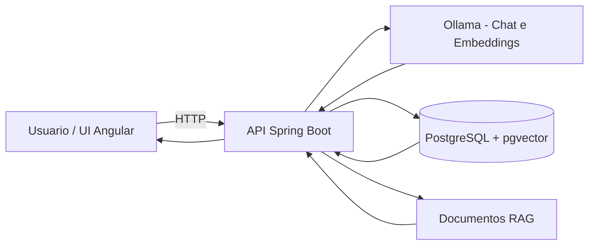

# AI Inventory Agent

Plataforma de assistente de estoque baseada em IA para consulta de dados operacionais em linguagem natural, combinando:

- Backend Java com Spring Boot
- Orquestracao com Spring AI + Ollama
- Persistencia em PostgreSQL (com pgvector)
- Frontend Angular para operacao (chat + painel de estoque)

## Sumario

- [Visao Geral](#visao-geral)
- [Arquitetura](#arquitetura)
- [Stack Tecnologica](#stack-tecnologica)
- [Estrutura do Repositorio](#estrutura-do-repositorio)
- [Como Executar com Docker](#como-executar-com-docker)
- [Como Executar Localmente (sem Docker)](#como-executar-localmente-sem-docker)
- [Frontend (UI)](#frontend-ui)
- [API Reference](#api-reference)
- [Testes e Qualidade](#testes-e-qualidade)
- [Observabilidade e Operacao](#observabilidade-e-operacao)
- [Troubleshooting](#troubleshooting)
- [Roadmap MVP](#roadmap-mvp)

## Visao Geral

O projeto entrega um fluxo MVP para operacao de estoque com IA:

1. O usuario pergunta em linguagem natural pelo endpoint de chat.
2. O orquestrador consulta ferramentas e contexto (banco e manuais).
3. O sistema retorna uma resposta textual consolidada no campo `resposta`.

A aplicacao tambem expoe CRUD de produtos para gestao do catalogo de estoque.

## Arquitetura



Principais responsabilidades:

- `ChatController`: recebe perguntas e devolve resposta textual.
- `OrquestradorHibridoService`: coordena raciocinio e uso de ferramentas.
- `ProdutoController`: endpoints REST para CRUD de produtos.
- `RagIngestionService`: ingestao de documentos para busca semantica.

## Stack Tecnologica

- Backend: Java 21, Spring Boot 3.5, Spring Data JPA, Spring Security
- IA: Spring AI 1.0.0-M6, Ollama (`llama3.2`, `nomic-embed-text`)
- Banco: PostgreSQL 15 (imagem `pgvector/pgvector:pg15`), Flyway
- Frontend: Angular 21
- Testes:
  - Backend: JUnit 5 + Spring Boot Test
  - Frontend: Vitest (`ng test`)
- DevOps: Docker, Docker Compose

## Estrutura do Repositorio

```text
.
├── src/main/java/com/AgentAIEstoque/application
│   ├── config
│   ├── controller
│   ├── dto
│   ├── entity
│   ├── exception
│   ├── repository
│   └── service
├── src/main/resources
│   ├── application.yaml
│   ├── db/migration
│   ├── manuais
│   └── prompts
├── agente-estoque-ui
│   └── src/app
├── docker-compose.yaml
├── Dockerfile
└── pom.xml
```

## Como Executar com Docker

### Pre-requisitos

- Docker
- Docker Compose

### Subir ambiente completo

```bash
docker-compose up --build -d
```

### Primeira execucao recomendada (reset completo)

Para garantir que todas as migrations (incluindo a carga rica de estoque) sejam aplicadas em ambiente limpo:

```bash
docker compose down -v
docker compose up --build -d
```

Depois valide:

```bash
docker compose ps
```

Servicos iniciados:

- API: `http://localhost:8080`
- Frontend: `http://localhost:4200`
- PostgreSQL: `localhost:5001`
- Ollama: `http://localhost:11001`

### Verificar status

```bash
docker-compose ps
```

### Parar ambiente

```bash
docker-compose down
```

## Como Executar Localmente (sem Docker)

### Backend

Pre-requisitos:

- Java 21+
- Maven 3.9+
- PostgreSQL disponivel em `localhost:5001`
- Ollama disponivel em `localhost:11001`

Comandos:

```bash
./mvnw clean package -DskipTests
./mvnw spring-boot:run
```

### Modelos Ollama esperados

- `llama3.2`
- `nomic-embed-text`

## Frontend (UI)

A UI fica em `agente-estoque-ui` e contem:

- Chat de perguntas para o agente
- Painel de produtos em estoque

### Frontend via Docker Compose (recomendado)

O frontend sobe junto com os demais servicos via `docker compose up --build -d` e fica disponivel em:

- `http://localhost:4200`

A imagem do frontend gera um arquivo de configuracao em runtime (`env.js`) no startup do container, usando a variavel de ambiente `API_URL`.

No `docker-compose.yaml`, o valor padrao esta como:

- `API_URL=/api`

Com isso, as chamadas do frontend usam rota relativa e o Nginx faz proxy para o backend (`api-agent:8080`), evitando acoplamento com `localhost:8080` no codigo da UI.

Para apontar para outra API em ambiente diferente, altere apenas a variavel `API_URL` no servico `frontend-ui` do Compose.

Executar localmente:

```bash
cd agente-estoque-ui
npm install
npm run start
```

Build de producao:

```bash
npm run build
```

> Nota: em execucao via Docker Compose, o frontend acessa a API por `/api` (proxy Nginx). Em execucao local com `ng serve`, a UI usa fallback para `http://localhost:8080/api` quando `env.js` nao estiver presente.

## API Reference

Base URL: `http://localhost:8080`

### Chat

#### `POST /api/estoque/chat/perguntar`

Request:

```json
{
  "pergunta": "Quais produtos estao com estoque critico?"
}
```

Response 200:

```json
{
  "resposta": "No momento, os produtos em nivel critico sao ..."
}
```

Erros comuns:

- 400 quando `pergunta` estiver vazia.

#### `POST /api/estoque/chat/ingerir-documentos`

Dispara processamento de manuais para base vetorial.

Response 200:

```json
{
  "status": "Sucesso",
  "mensagem": "Manuais foram vetorizados no Banco de Dados"
}
```

### Produtos

#### `GET /api/produtos`

Lista produtos.

Response 200 (exemplo):

```json
[
  {
    "id": "f50adbbf-2ed5-4f45-b95b-4d5e3a7e2e13",
    "nome": "Teclado Mecanico",
    "sku": "TEC-001",
    "preco": 199.9,
    "categoria": {
      "id": "e4f67cc4-33c9-4d63-a6af-a2b8fd07d95f",
      "nomeCategoria": "Perifericos"
    },
    "quantidadeAtual": 12
  }
]
```

#### `POST /api/produtos`

Cria produto.

Request (exemplo):

```json
{
  "nome": "Teclado Mecanico",
  "sku": "TEC-001",
  "preco": 199.9,
  "categoria": {
    "id": "e4f67cc4-33c9-4d63-a6af-a2b8fd07d95f"
  },
  "quantidadeAtual": 12
}
```

Response 201: produto criado.

#### `GET /api/produtos/{id}`

Busca produto por id.

#### `PUT /api/produtos/{id}`

Atualiza produto por id.

#### `DELETE /api/produtos/{id}`

Exclui produto por id. Retorna `204 No Content`.

## Testes e Qualidade

### Backend

```bash
./mvnw test
```

### Frontend

```bash
cd agente-estoque-ui
npm test -- --watch=false
```

## Validacao ponta a ponta

1. Confira dados de estoque carregados (via API direta):

```bash
curl http://localhost:8080/api/produtos
```

2. Confira integracao frontend -> API pelo proxy `/api`:

```bash
curl http://localhost:4200/api/produtos
```

3. Ingerir manuais para RAG:

```bash
curl -X POST http://localhost:8080/api/estoque/chat/ingerir-documentos
```

4. Perguntar ao agente:

```bash
curl -X POST http://localhost:8080/api/estoque/chat/perguntar \
  -H "Content-Type: application/json" \
  -d '{"pergunta":"Quais itens estao abaixo do estoque minimo de seguranca?"}'
```

## Observabilidade e Operacao

Logs:

```bash
docker-compose logs -f
docker-compose logs -f api-agent
docker-compose logs -f postgres
docker-compose logs -f ollama
```

Health checks uteis:

```bash
docker-compose exec postgres pg_isready -U root -d estoque_db
curl http://localhost:11001/api/tags
```

## Troubleshooting

### Falha ao conectar no banco (`Connection refused localhost:5001`)

- Garanta que o container `estoque-db` esteja `healthy`.
- Reexecute:

```bash
docker-compose up -d
```

### Testes backend falham por dependencia externa

Os testes de contexto precisam do banco disponivel na URL configurada (`localhost:5001`).

### API nao responde perguntas de IA

- Verifique se `ollama-init` concluiu com sucesso.
- Confira modelos carregados:

```bash
curl http://localhost:11001/api/tags
```

## Roadmap MVP

Itens recomendados para evolucao imediata:

- Endpoints de health (`/actuator/health`) com Spring Boot Actuator.
- Melhorar isolamento de testes backend (container de teste dedicado).
- Endurecimento de seguranca para ambiente produtivo (authN/authZ).
- Contrato OpenAPI/Swagger versionado para clientes.
- Pipeline CI com build + testes backend/frontend.

---

Projeto mantido por `Joaovirone/AgenteIAEstoque`.
